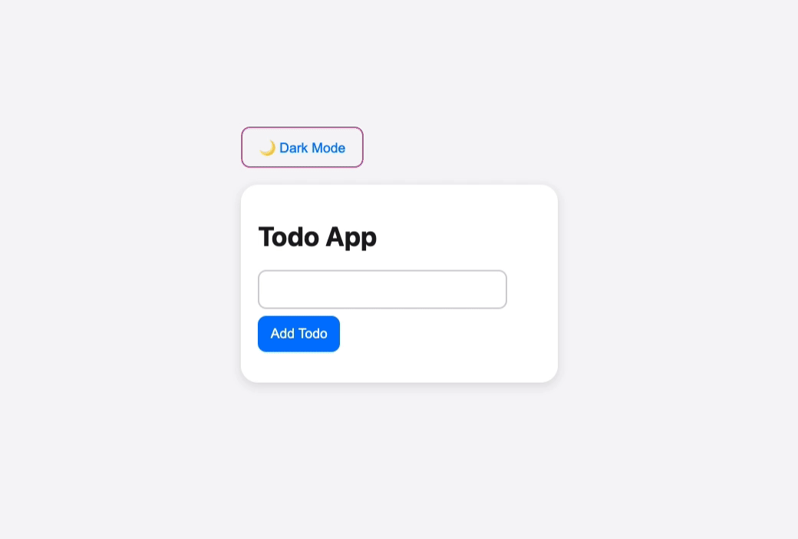

# Todo App

This project is a simple React application using Context API and Vite for fast development and build processes.

## Preview

## Features

1️⃣ **Todo List with Context API**
📝 **Concepts Covered:** State management, Context API, Component composition

### Features:
- Add, edit, and delete tasks
- Mark tasks as completed
- Store tasks globally using Context API instead of prop drilling

🔗 **Key Takeaways:** state lifting, context API, and structuring reusable components.